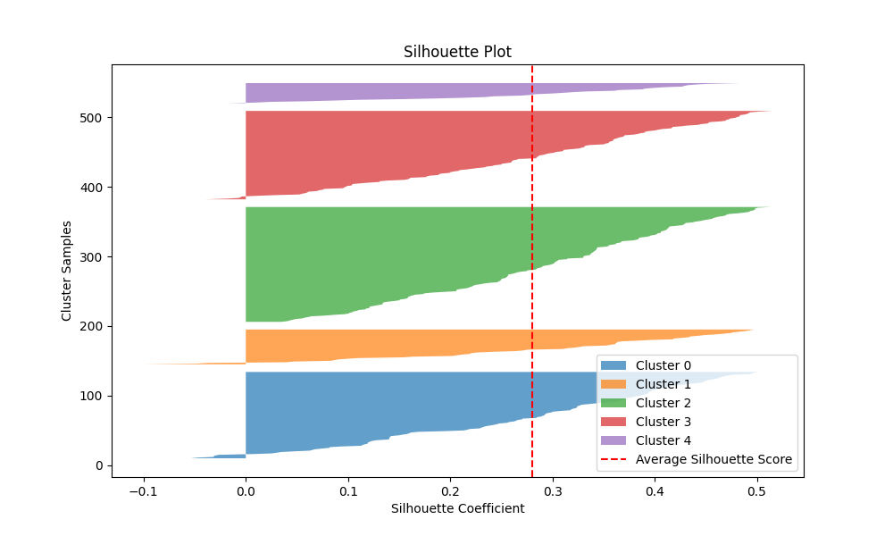
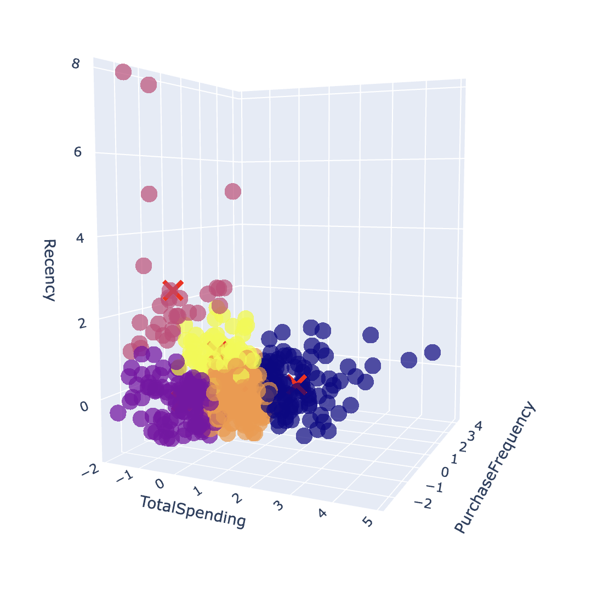

# Bookedby Assignment - Recommendation CLI

## Author
**Yanmei Wang**  
*Email*: [wyanmei@umich.edu](mailto:wyanmei@umich.edu)  

## Overview
This recommendation CLI aims to generate synthetic data, analyze data, perform clustering, and provide simple AI-based product recommendations based on customer's purchase history.

## Functionalities
- **Data Generation** 
  - Generate synthetic product purchase data.
- **Data Analysis** 
  - Analyze the generated dataset for preliminary insights.
- **Clustering** 
  - Perform K-means clustering with Silhouette evaluation. Also provides distortion analysis to determine the best number of clusters.  
- **Recommendation** 
  - Generate recommendations (including one novel product to uncover new preferences) using content-based filtering.
- **Run All** 
  - Run the aforementioned functionalities using the default configuration.
- **Clear All** 
  - Clear all generated and intermediate data.

## Prerequisites
- Python 3.7+ (Developed in Python 3.9)
- Project dependencies are listed in `requirements_arm.txt` and `requirements_intel.txt`

## Installation
1. Clone the repository from GitHub
2. (Optional but strongly recommended) Setup Python virtual environment 
3. Install the required dependencies:
   ```bash
   # For ARM64 machines
   pip install -r requirements_arm64.txt
   
   # For x86 machines
   pip install -r requirements_intel.txt
   ```
4. Review [config.py](config.py)
   - Ensure the paths and default values in `config.py` are correctly configured.

## Commands

Basic usage: 
```bash
python3 cli.py [command] [options]
```

The default values in this section can be modified in `config.py`. For command-specified assistance, please refer to:
```bash
python3 cli.py [command] --help
```
---
### 1. Run All
```bash
# Run the entire pipeline from data generation (if no datasets are found at DATA_PATH) to recommendation.
# Any existing dataset won't be overwritten. 
python3 cli.py run-all
```
To overwrite the existing dataset, add the -d flag:
```bash
# Run the entire pipeline from data generation (overwrite existing dataset) to recommendation.
python3 cli.py run-all -d
```
### 2. Clear All
```bash
# Clear all generated data and intermediate results.
python3 cli.py clear-all
```
### 3. Data Generation
```bash
# Generate synthetic product data and purchase data.
python3 cli.py generate -p <product_path> -np <num_products> -nc <num_customers> -ne <num_entries>
```
Options:
- `-p`, `--product_path`: Path to the products list CSV (default: `data/products.csv`).
- `-np`, `--num_products`: Number of products to generate (default: 80).
- `-nc`, `--num_customers`: Number of customers to generate (default: 500).
- `-ne`, `--num_entries`: Number of purchase entries to generate (default: 5000).

The generated data will be saved in `DATA_PATH`.

### 4. Data Analysis
```bash
# Perform data analysis.
python3 cli.py analyze
```
### 5. Clustering
```bash
# Prepare Data for Clustering.
python3 cli.py clustering prepare
```
```bash
# Perform Distortion Evaluation using Elbow Method.
python3 cli.py clustering elbow-method
```
The generated distortion graph will be saved in `CLUSTER_OUTPUT_PATH`.

```bash
# Perform K-Means Clustering.
python3 cli.py clustering kmeans -c <num_clusters>
```
Options:
- `-c`, `--num_clusters`: Number of clusters (default: 6).

The results of `kmeans` will be saved in `CLUSTER_OUTPUT_PATH`, including:
- A clustered dataset
- An interactive 3D plot in `.html` format
- A CSV file of cluster centroids
- A Silhouette score plot.

It is recommended to view the 3D plot using browsers such as Chrome and Firefox. 

### 6. Recommendation
```bash
# Perform Density Check.
# The result will be print to the console. 
python3 cli.py recommendation check-density
```
```bash
# Prepare Recommendation Data.
python3 cli.py recommendation prepare -m <method>
```
Options:
- `-m`, `--method`: Data preparation method (`nlp` (recommended) or `pairwise`).
```bash
# Perform Content-Based Recommendation for Specified Customer.
python3 cli.py recommendation content-filter -cid <customer_id> -nc <num_category> -np <num_product>
```
Options:
- `-cid`, `--customer_id`: Customer ID (e.g., `C001`, `C124`, or `C000` for new customers).
- `-nc`, `--num_category`: Number of categories to recommend (default: 2).
- `-np`, `--num_product`: Number of products per category to recommend (default: 2).

The results will be print to the console AND saved in `REC_OUTPUT_PATH`.

```bash
# Perform Content-Based Recommendation for All Customers.
python3 cli.py recommendation content-filter-all
```
The results will be print to the console AND saved in `REC_OUTPUT_PATH`.

## Evaluation
### Data Generation
This project generates synthetic datasets using random sampling and [Faker](https://faker.readthedocs.io/en/master/) library. 

While data generation is not the main focus of this project, it is critical to evaluate the quality of synthetic dataset and ensure that it mimics the features of the intended purpose. However, due to time constraints, this project does not include a detailed evaluation script for its dataset.

It is recommended to use real-world data or to perform a thorough evaluation of the generated data using general data evaluation methods.

---
### Clustering
#### 1. Silhouette Plot

A silhouette plot evaluates the quality of clustering by displaying how well each sample is assigned to its cluster. The **silhouette coefficient** for each sample is a measure of **cohesion** (how close it is to points in the same cluster) versus **separation** (how far it is from points in other clusters).

- **Silhouette Score Range**: `[-1, 1]`

  - Close to 1: The sample is well-clustered.
  - Close to 0: The sample is near a cluster boundary.
  - Negative values: The sample might be misclassified.
  - Average Silhouette Score: The red dashed line indicates the average silhouette score for all clusters.

#### 2. Interactive 3D Plot

The interactive 3D clustering plot is created using [Plotly](https://plotly.com/) library. You may explore the spatial distribution of clusters by rotating and zooming the plot in a web browser.

---
### Recommendations
#### Qualitative Methods
In any real-world scenario, the recommendation algorithm can be tested by collecting user feedback and perform imn-depth case study. 

#### Quantitative Methods
There are several metrics suitable for evaluating recommendation results:
- Precision
  - `Relevant recommended products / Total recommended products`
- Recall
  - `Relevant recommended products / All relevant products` 
  - More suitable for large number of recommendation
- F1 Score
  - `2 * (Precision * Recall / (Precision + Recall))`
  - A harmonic mean of Precision and Recall to balance their trade-offs.
- ...

As an example, given the following recommendation result:
```plaintext
   Customer C001's purchase history:
           Home & Furniture
                   Recliner Chair
                   Storage Ottoman
           Tech & Electronics
                   VR Headset
                   Portable Power Bank
           Accessories & Lifestyle
                   Smart Key Finder
                   Scarf
           Clothing & Apparel
                   Swimwear
           Kitchen & Appliances
                   Cookware Set
           Fitness & Sports
                   Tennis Racket
   
   Recommendations (familiar):
           Home & Furniture
                   Wardrobe
                   Sofa
           Tech & Electronics
                   Smartwatch
                   Laptop
   
   Recommendations (novel):
           Toys & Games
                   Play Kitchen Set
```
The precision score can be calculated as follows:
- Assume `Sofa`, `Ottoman Storage`, and `Smartwatch` are relevant recommendations whereas `Wardrobe` is less relevant.
- `Precision = 3/4 = 0.75 (75%)`

As for the novel recommendation, it can be observed that the user has bought a `Cookware Set`, which is likely to be the reason for this recommendation. 

## Examples
1. Prepare recommendation data using NLP-based preprocessing:
   ```bash
   python3 cli.py recommendation prepare -m nlp
   ```
   Sample Output
   ```plaintext
   2025-01-13 12:57:49,146 - INFO - Preparing recommendation data using method 'nlp'...
   2025-01-13 12:57:53,476 - INFO - Use pytorch device_name: mps
   2025-01-13 12:57:53,476 - INFO - Load pretrained SentenceTransformer: all-MiniLM-L6-v2
   Generating embeddings for product metadata...
   Batches: 100%|█████████| 3/3 [00:00<00:00,  6.17it/s]
   Computing similarity matrix...
   Saving results...
   Precomputed semantic similarity matrix, product index, and metadata saved.
   2025-01-13 12:57:55,077 - INFO - Recommendation data preparation completed.
   ```

2. Recommend `2` products from each of the `2` most familiar categories for customer `C001`:
   ```bash
   python3 cli.py recommendation content-filter -cid C001 -nc 2 -np 2
   ```
   Sample Output
   ```plaintext
   2025-01-13 12:54:30,050 - INFO - Performing content-based recommendation for customer C001...
   
   Customer C001's purchase history:
           Home & Furniture
                   Recliner Chair
                   Storage Ottoman
           Tech & Electronics
                   VR Headset
                   Portable Power Bank
           Accessories & Lifestyle
                   Smart Key Finder
                   Scarf
           Clothing & Apparel
                   Swimwear
           Kitchen & Appliances
                   Cookware Set
           Fitness & Sports
                   Tennis Racket
   
   Recommendations (familiar):
           Home & Furniture
                   Wardrobe
                   Sofa
           Tech & Electronics
                   Smartwatch
                   Laptop
   
   Recommendations (novel):
           Toys & Games
                   Play Kitchen Set
   Recommendations done! Results are saved at project_root/results/recommendations
   2025-01-13 12:54:30,796 - INFO - Content-based recommendation completed.
   ```